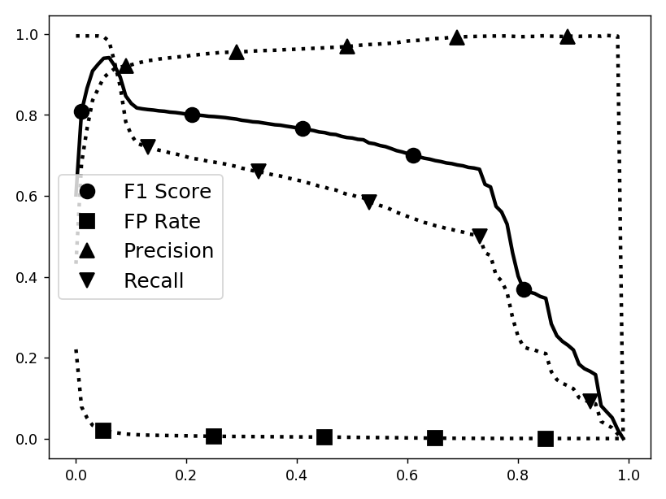
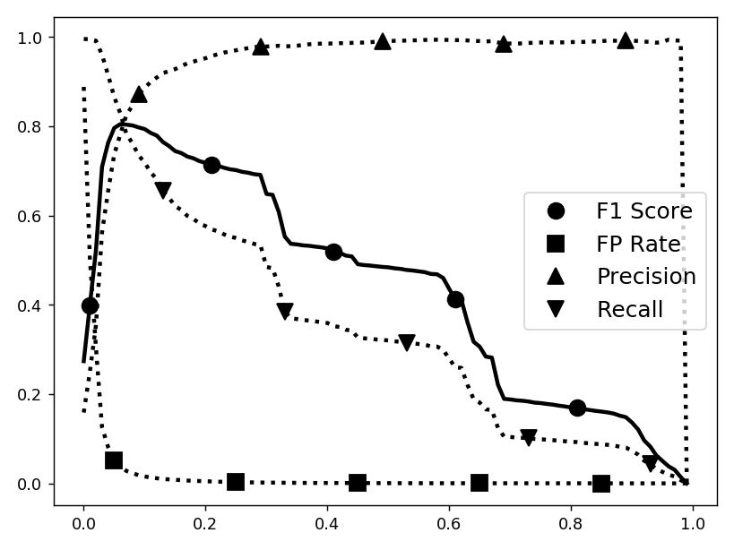

# DabLog

***DabLog***: A ***D***eep ***A***utoencoder-***B***ased Anoamly Detection Method for Discrete Event ***Log***s

Lun-Pin Yuan, Peng Liu, and Sencun Zhu. 2021. Recompose Event Sequencesvs. Predict Next Events: A Novel Anomaly Detection Approach for DiscreteEvent Logs. InProceedings of the 2021 ACM Asia Conference on Computerand Communications Security (ASIA CCS ’21), June 7–11, 2021, Virtual Event,Hong Kong.ACM, New York, NY, USA, 13 pages. 

[https://doi.org/10.1145/3433210.3453098](https://doi.org/10.1145/3433210.3453098) 

[https://arxiv.org/abs/2012.13972](https://arxiv.org/abs/2012.13972)


# System Requirement

This project was developed on ***BIZON G3000 – 2-4 GPU Deep Learning Workstation PC*** (spec listed below).  This project requires ***64 GB memory***, or it will crash during runtime.  It took *1-2 hours* to run a single executation (i.e., *exp-unswnb15.py* and *exp-sosp2009.py*).  A single execution includes training, testing, and generating evaluation metrics, but not preprocessing and plotting.

| Spec          | Description                                                  |
| ------------- | ------------------------------------------------------------ |
| Processor     | Skylake X; 8-Core 3.80 GHz Intel Core i7-9800X               |
| Memory        | DDR4 3000MHz 64 GB (4 x 16 GB)                               |
| Graphics Card | 2 x NVIDIA RTX 2080 8 GB with NVLink and 1 x NVLink Bridge   |
| System        | Ubuntu 18.04 Bionic (not using Bizon's preinstalled package) |
| Environment   | Python 3.7.4, Tensorflow 2.0.0, and Anaconda 4.7.12          |

# Datasets

The ***data*** folder provides a few preprocessed data examples.  For full dataset, please find them from the links below.  

| Name      | Content | Link |
| --------- | ------- | ---- |
| UNSW-NB15 | Network Traffic Capture | [https://research.unsw.edu.au/projects/unsw-nb15-dataset](https://research.unsw.edu.au/projects/unsw-nb15-dataset) |
| SOSP 2009 | Hadoop File System Log  | [http://people.iiis.tsinghua.edu.cn/~weixu/sospdata.html](http://people.iiis.tsinghua.edu.cn/~weixu/sospdata.html) |

Please preprocess the dataset on your own.  For *UNSW-NB15*, the ***unswnb15*** folder provides two scripts.  Please run the following command to preprocess UNSW-NB15.  For *SOSP 2009*, please simply split the dataset based on block ID on your own (no script provided).

```
python3 unswnb15/split.py [UNSW-NB15 csv files] -d [destination directory]
python3 unswnb15/split.py UNSW-NB15_1.csv UNSW-NB15_2.csv UNSW-NB15_3.csv UNSW-NB15_4.csv -d data/unswnb15/data
```

# Execution Examples

## UNSW-NB15

Please add flags if needed.  For example, to specificy input directory, use *-i /data/unswnb15/data*.  Please use *-h* for flag options.

```
python3 exp-unswnb15.py ad -o out/2020-10-21_deeplog_k706_ip1hr -m deeplog --window-size 60 --key-divisor 100 ; \
python3 exp-unswnb15.py ad -o out/2020-10-21_dablog_k706_ip1hr -m dablog --window-size 60 --key-divisor 100  ; \
python3 exp-unswnb15.py ad -o out/2020-10-21_deeplog_k706_iphhr -m deeplog --window-size 30 --key-divisor 100 ; \
python3 exp-unswnb15.py ad -o out/2020-10-21_dablog_k706_iphhr -m dablog --window-size 30 --key-divisor 100  ; \
python3 exp-unswnb15.py ad -o out/2020-10-21_deeplog_k706_ipqhr -m deeplog --window-size 15 --key-divisor 100 ; \
python3 exp-unswnb15.py ad -o out/2020-10-21_dablog_k706_ipqhr -m dablog --window-size 15 --key-divisor 100  ; \
python3 exp-unswnb15.py ad -o out/2020-10-21_deeplog_k366_ip1hr -m deeplog --window-size 60 --key-divisor 1000 ; \
python3 exp-unswnb15.py ad -o out/2020-10-21_dablog_k366_ip1hr -m dablog --window-size 60 --key-divisor 1000  ; \
python3 exp-unswnb15.py ad -o out/2020-10-21_deeplog_k366_iphhr -m deeplog --window-size 30 --key-divisor 1000 ; \
python3 exp-unswnb15.py ad -o out/2020-10-21_dablog_k366_iphhr -m dablog --window-size 30 --key-divisor 1000  ; \
python3 exp-unswnb15.py ad -o out/2020-10-21_deeplog_k366_ipqhr -m deeplog --window-size 15 --key-divisor 1000 ; \
python3 exp-unswnb15.py ad -o out/2020-10-21_dablog_k366_ipqhr -m dablog --window-size 15 --key-divisor 1000  ; \
```

## SOSP 2009

Please add flags if needed.  For example, to specificy input directory, use *-i /data/sosp2009/data*.  Please use *-h* for flag options.

```
python3 exp-sosp2009.py seqad -l label.txt --use-gpu 1 --test-normal 200000 -o exp/2020-02-27_1 -m sdlog --no-mimick ;\
python3 exp-sosp2009.py seqad -l label.txt --use-gpu 1 --test-normal 200000 -o exp/2020-02-27_3 -m sdae --no-mimick ;\
python3 exp-sosp2009.py seqad -l label.txt --use-gpu 1 --test-normal 200000 -o exp/2020-02-27_5 -m sdlog --no-mimick ;\
python3 exp-sosp2009.py seqad -l label.txt --use-gpu 1 --test-normal 200000 -o exp/2020-02-27_7 -m sdae --no-mimick ;\
python3 exp-sosp2009.py seqad -l label.txt --use-gpu 1 --test-normal 200000 -o exp/2020-02-27_9 -m sdlog --no-mimick ;\
python3 exp-sosp2009.py seqad -l label.txt --use-gpu 1 --test-normal 200000 -o exp/2020-02-27_11 -m sdae --no-mimick ;\
python3 exp-sosp2009.py seqad -l label.txt --use-gpu 1 --test-normal 200000 -o exp/2020-02-27_13 -m sdlog --no-mimick ;\
python3 exp-sosp2009.py seqad -l label.txt --use-gpu 1 --test-normal 200000 -o exp/2020-02-27_15 -m sdae --no-mimick ;\
python3 exp-sosp2009.py seqad -l label.txt --use-gpu 1 --test-normal 200000 -o exp/2020-02-27_19 -m sdae --no-mimick ;\

python3 exp-sosp2009.py seqad -l label.txt --use-gpu 0 --logkeys 2 --train-normal 5000 --epochs 64 --test-normal 200000 -o exp/2020-02-28_1 -m sdlog --no-mimick ;\
python3 exp-sosp2009.py seqad -l label.txt --use-gpu 0 --logkeys 3 --train-normal 5000 --epochs 256 --test-normal 100000 -o exp/2020-02-29_1 -m sdlog --no-mimick ;\
python3 exp-sosp2009.py seqad -l label.txt --use-gpu 0 --logkeys 3 --train-normal 100000 --test-normal 100000 -o exp/2020-02-29_2 -m sdlog --no-mimick ;\
python3 exp-sosp2009.py seqad -l label.txt --use-gpu 0 --logkeys 3 --train-normal 100000 --test-normal 100000 -o exp/2020-02-29_9 -m sdae --no-mimick ;\
python3 exp-sosp2009.py seqad -l label.txt --use-gpu 0 --logkeys 0 --seqlen 10 --train-normal 5000 --test-normal 300000 --epochs 128 -o exp/2020-04-15_1 -m sdlog --no-mimick ;\
python3 exp-sosp2009.py seqad -l label.txt --use-gpu 0 --logkeys 0 --seqlen 10 --train-normal 5000 --test-normal 300000 --epochs 128 -o exp/2020-04-15_3 -m sdae --no-mimick ;\
python3 exp-sosp2009.py seqad -l label.txt --use-gpu 0 --logkeys 2 --seqlen 10 --train-normal 5000 --test-normal 200000 --epochs 128 -o exp/2020-04-15_7 -m sdae --no-mimick ;\
python3 exp-sosp2009.py seqad -l label.txt --use-gpu 0 --logkeys 3 --seqlen 10 --train-normal 5000 --test-normal 200000 --epochs 128 -o exp/2020-04-15_8 -m sdae --no-mimick ;\
python3 exp-sosp2009.py seqad -l label.txt --use-gpu 0 --logkeys 0 --test-normal 200000 -o exp/2020-04-15_9 -m sdlog --no-mimick ;\
python3 exp-sosp2009.py seqad -l label.txt --use-gpu 0 --logkeys 0 --test-normal 200000 -o exp/2020-04-15_10 -m sdae --no-mimick ;\
```

## Plot and Analysis

The ***paper*** folder provides scripts we used when writing our paper.  The ***paper*** includes plotter scripts.  Please modify the directory paths before use.  

```
python3 plot/plot-unswnb15.py
python3 plot/plot-sosp2009.py
```

| Dataset   | Comparison | DabLog | Baseline Predictor |
| --------- | ---------- | ------ | --------- |
| UNSW-NB15 <br> (366 keys) |  |  |  |
| UNSW-NB15 <br> (706 keys) |  |  |  |
| SOSP 2009 <br> (101 keys) |  |  |  |
| SOSP 2009 <br> (304 keys) |  |  |  |


# Misc Note

There are a few un-used code and un-used parameters.  They are our undergoing work.  I would suggest not to alter them, but feel free to explore.  Happy hacking!
